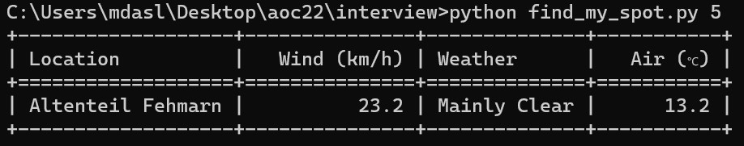

# Weather-API
A command line application, that queries a weather API and orders locations by best wind surfing conditions at a user-defined time offset (hours).

# What are good surfing conditions?
- Most importantly, we need wind as the single most important criterion.
- Wind forecasts are not precise, i.e. differences of 5 km/h are not considered.
- Second criterion for best weather location been considered based on the how good the sun will shine.

# CLI interface


# Weather API
For this work, the url https://open-meteo.com/ has been used to make requests.

Following is the weather forecast request for Munich.
```bash
curl "https://api.open-meteo.com/v1/forecast?latitude=48.1374&longitude=11.5755&hourly=temperature_2m,weathercode,windspeed_10m"
```

# Locations

The following dictionary has been used as known surf locations to check:
```python
SPOTS_LAT_LONG = {
    'Altenteil Fehmarn': (54.4667, 11.1333),
    'Ammersee': (48.0011, 11.1333),
    'Bodensee': (47.6667, 9.1667),
    'Chiemsee': (47.8667, 12.35),
    'Comer See': (46.0167, 9.2667),
    'Gardasee': (45.6667, 10.7),
    'Silvaplana See': (46.4411, 9.7667),
    'Starnberger See': (47.9667, 11.35),
    'Tegernsee': (47.7, 11.7333),
    'Walchensee': (47.6, 11.3667),
}
```
# Weather Codes

The following dictionary has been used to check for weather codes:
```python
weather_code_ranges = {
    (0, 0): "Sunny",
    (1, 10): "Mainly Clear",
    (11, 30): "Partly Cloudy",
    (31, 70): "Mostly Cloudy",
    (71, 75): "Foggy",
    (76, 80): "Light Rain",
    (81, 85): "Moderate Rain",
    (86, 90): "Heavy Rain",
    (91, 95): "Rain with Thunder",
    (96, 96): "Thunderstorm with Slight Hail",
    (97, 97): "Thunderstorm with Hail",
    (98, 98): "Sleet Showers",
    (99, 99): "Thunderstorm with Heavy Hail",
}
```